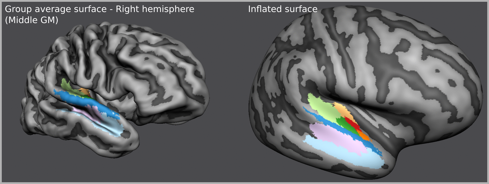
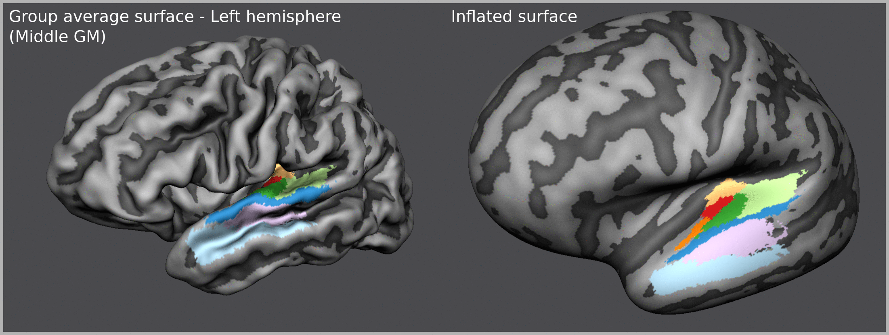
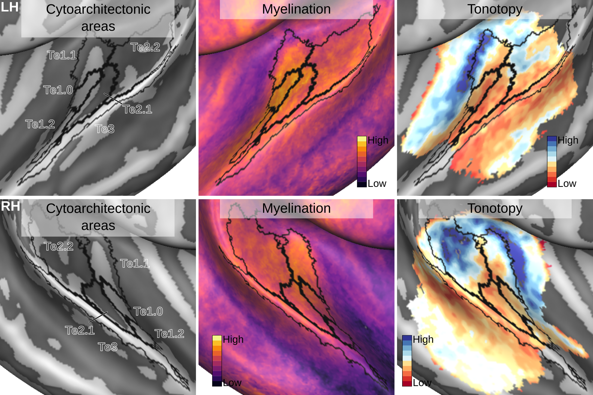

# Human cortical (cytoarchitectonic) auditory atlas
Resources from our cortical auditory areas project that combines the gold-standard human histology images from [**JuBrain**](https://jubrain.fz-juelich.de) with state of the art in-vivo human magnetic resonance imaging (MRI) at ultra-high fields (7 Tesla). More specifically:

1. We use **10 individual brains with cytoarchitectonically labelled areas** to create a surface atlas that is optimized for the human auditory cortex. This atlas is shared here as a resource for fellow researchers:

2. We make use of our atlas in combination with ultra-high field MRI to visualize the underlying in-vivo measurements such as myelination and tonotopy. This is done to exemplify a potential use case of our cytoarchitectonic atlas:

## Atlas
- See [this document](resources/surfaces_invivo/readme.md).
- Then follow [this link]( https://osf.io/4mjpn/).

## Source data
- Individual brain cytoarchitectonic areas on surface meshes from:  
<https://kg.ebrains.eu/search/instances/Dataset/ff71a4d1-ea14-4ed6-898e-b92d95b3c446>
- Individual in-vivo 7T MRI data from:  
<https://openneuro.org/datasets/ds001942/versions/1.2.0>

## Methods
- We created our surface atlas by incorporating anatomical priors into standard curvature based alignment pipeline as implemented in BrainVoyager 21.4. See [**this document**](resources/CBAplus_steps/README.md) for the steps involved.

- Since BrainVoyager is a commercial software which might not be available to all researchers, we share our resources here to help others implementing this method on their own. Feel free to ask questions on this repository's issues page.

## Citation
If you benefit from this project in your own work, we would highly appreciate if you cite the following two articles:

- **Gulban, O.F.**, Goebel R., Moerel M., Zachlod D., Mohlberg H., Amunts K., De Martino F. (2020). Improving a probabilistic cytoarchitectonic atlas of auditory cortex using a novel method for inter-individual alignment. eLife. <https://elifesciences.org/articles/56963>

- **Zachlod, D.**, Rüttgers, B., Bludau, S., Mohlberg, H., Langner, R., Zilles, K., & Amunts, K. (2020). Four new cytoarchitectonic areas surrounding the primary and early auditory cortex in human brains. Cortex, 128, 1–21. <https://doi.org/10.1016/j.cortex.2020.02.021>

- In addition, if you use the source data please cite the corresponding datasets indicated in the **Source Data** section above.
