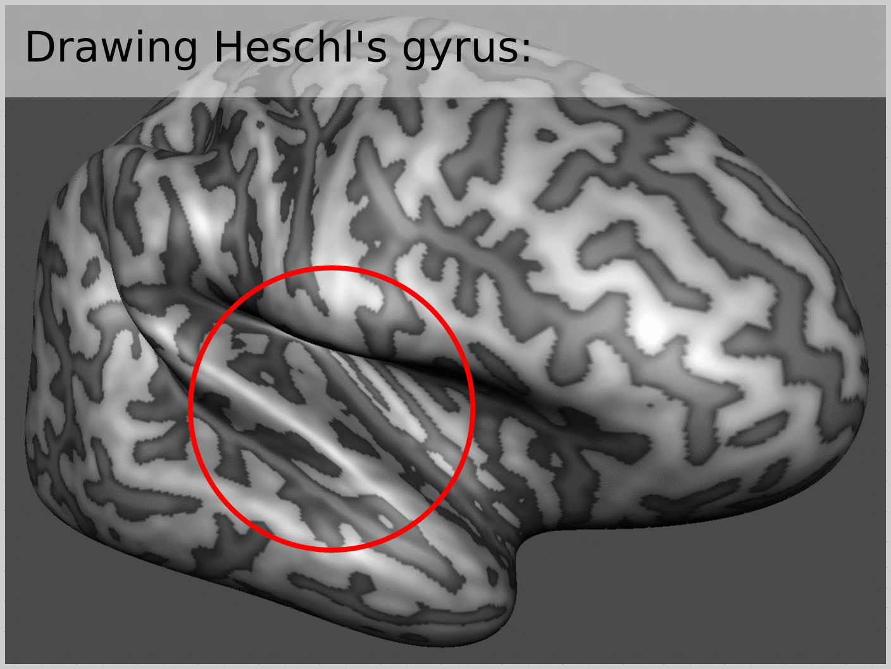
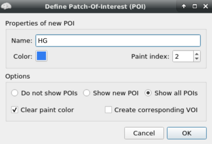
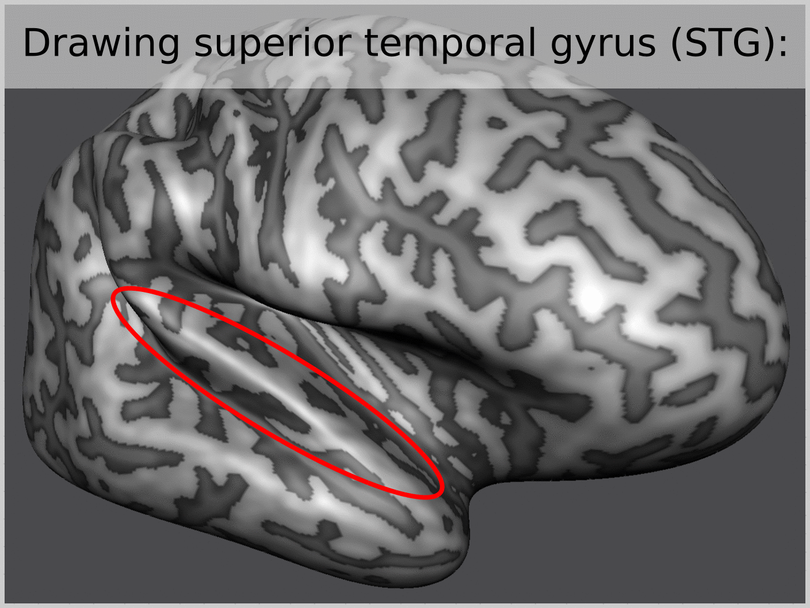
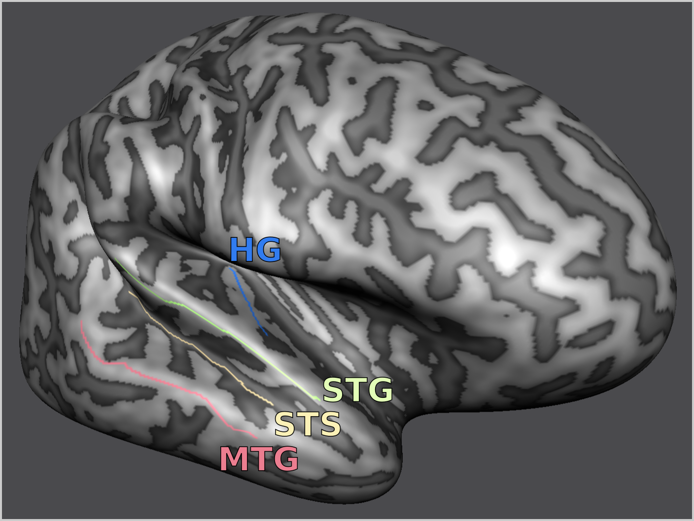
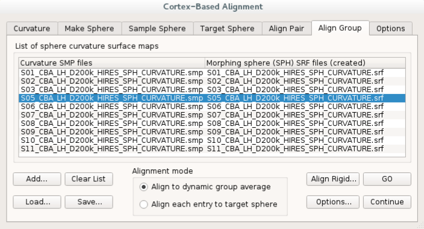
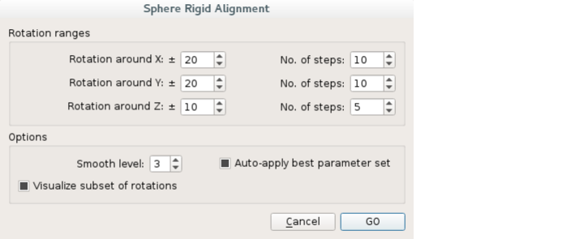
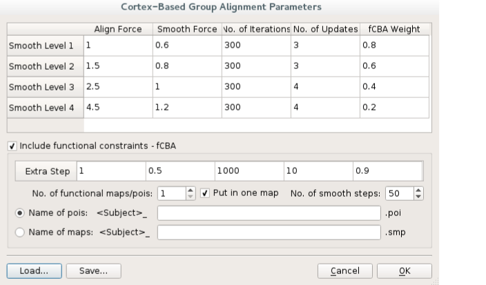

# How to perform CBA+ surface alignment

Follow these steps for running cortex based alignment (CBA) in `BrainVoyager v21.4`. If you are unfamiliar with CBA, see [this intorductory documentation](https://www.brainvoyager.com/bv/doc/UsersGuide/CortexBasedAlignment/CortexBasedAlignmentOfSulciAndGyri.html).

## Stage 1: Preparation for standard CBA

1. [Prepare a mesh for CBA.](https://www.brainvoyager.com/bv/doc/UsersGuide/CortexBasedAlignment/PreparingAMeshForCBA.html)

2. [Morh the mesh to a sphere.](https://www.brainvoyager.com/bv/doc/UsersGuide/CortexBasedAlignment/MorphingAReconstructedCortexHemisphereToASphere.html)

3. [Map the spherical mesh onto the standard sphere mesh.](https://www.brainvoyager.com/bv/doc/UsersGuide/CortexBasedAlignment/MappingTheStandardSphereToAMorphedSphere.html)

4. [Create multi-scale curvature maps.](https://www.brainvoyager.com/bv/doc/UsersGuide/CortexBasedAlignment/CreatingCurvatureMapsForAlignment.html)

## Stage 2: Additional preperation step required for CBA+

5. Draw anatomical priors on meshes by first enabling `draw on meshes` button then holding `ctrl` + clicking on desired vertices.
    - Draw Heschl's Gyrus (HG):

        

    - Use `Define path-of-interest` window.

        

    - Draw superior temporal gyrus (STG):

        

    - Repeat for all anatomical priors:

        

All the drawn individual anatomical priors are available at:
- [Our OSF data repository](https://osf.io/4mjpn/) (see `individual_invivo_MRI_surface_data` folder).

## Stage 3: Running CBA+
Note that each set of hemispheres are run separately. Which means that we have repeated this process twice.

6. Load each hemisphere.

7. Run rigid body alignment to make sure the starting point of CBAplus is optimized. We have used the default parameters as shown in the screenshot below.

8. Run CBAplus by using the `fCBA` option and passing the anatomical priors generated in Stage 2. We have used the default parameters as shown in the screenshot below. Note that although the user interface indicates `functional constraints`, we are not using functional MRI maps. We are only leveraging this functionality available in the program for passing our `anatomical priors` as `.poi` files as an additional constraint that is used in the alignment procedure.

## Stage 4: Quality control
The quality of the results depend on two major factors (in our experience):
- Quality of the surface meshes generated in Step 1 (e.g. no holes or bridges in the initial reconstructed meshes)
- Initial state of the curvature alignments being optimized (which is the reason why we first run spherical rigid body alignment in Step 7.)
As a minor factor:
- Make sure that the anatomical priors are not very close to each other so that the smoothed representations of them are not overlapping to a high degree (the amount of smoothing is determined by the `nr. smooth. steps` parameter in fCBA section in Step 8).
